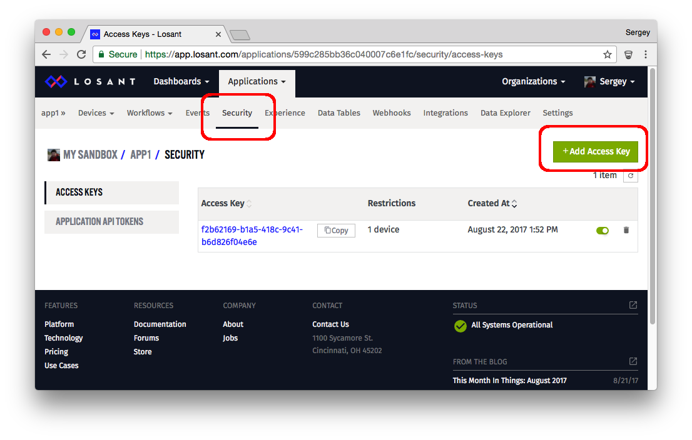
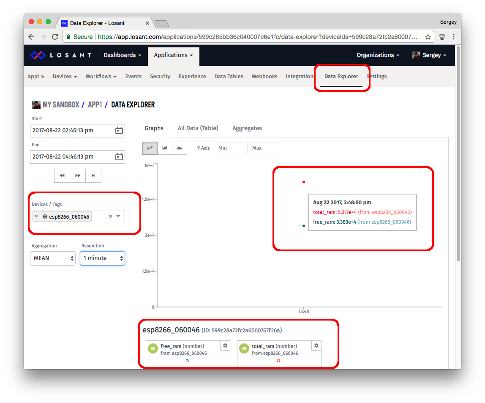

# Losant + Mongoose OS Example

This is an example Mongoose OS app that connects to Losant via MQTT. 

## Tested Hardware
- ESP8266
- ESP32

## Installation & Flashing

Before beginning, you must have the `mos` tool installed. For more info, see the mos [installation instructions](https://mongoose-os.com/docs/quickstart/setup.html). 

1. First, clone the losant app

```
$ git clone https://github.com/mongoose-os-apps/losant-mqtt
```

2. Build the firmware: (esp8266 or esp32)

```
$ mos build --arch esp8266 
```

3. Flash the device: (esp8266 or esp32)

```
$ mos flash 
```

4. Configure WiFi:
```
mos wifi WIFI_SSID WIFI_PASSWORD 
```
You must replace the following values:
- WIFI_SSID
- WIFI_PASSWORD

5. Login to Losant service. Create and app and 
  credentials for your device:



5. Configure MQTT connection to Losant:
```
mos config-set mqtt.client_id=LOSANT_DEVICE_ID \
  mqtt.user=LOSANT_ACCESS_KEY \
  mqtt.pass=LOSANT_ACCESS_SECRET
```  

You obtain the `LOSANT_DEVICE_ID`, `LOSANT_ACCESS_KEY`, and `LOSANT_ACCESS_SECRET` values from [Losant](www.losant.com). 

6. To stream logs to the terminal: 

```
$ mos console
```

7. Press "Flash" button to trigger data sending:

```
$ mos
```

8. Switch back to Losant page, watch data graph:


